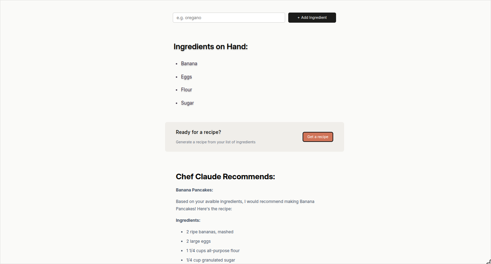

  
  
  

# Chef Bot

**Chef Bot** is a React-based web application that generates complete recipes from a list of user-provided ingredients. It leverages the **Zephyr AI API** to dynamically create structured, coherent, and practical recipes in real time.

This project was built as part of **Bob Ziroll’s** React course on **Scrimba**, focusing on modern React fundamentals, state management, and API integration.

## Installation

Try out the website with this link:

    https://chef-bot-three.vercel.app/

or, clone the repository

    git clone https://github.com/francogabrieloliveros/chef_bot.git

    npm install

    npm run dev

## Usage

Add as much ingredients as you like using the input bar. Once there are four or more ingredients, you can click get a recipe. Wait for a few seconds and let Chef Bot do the thinking job! A full on recipe will be presented based on the ingredients you requested so you can focus more on cooking rather than thinking!

## Additional Notes

- You must have at least **four** ingredients before asking chef bot for a recipe.
- Recipes are made by presenting your ingredients to **Zephyr AI** and making it come up with a recipe based on its training data.
- Requests for recipes may take time, please patiently wait a few seconds for the recipe to come up.
- This project was made through Bob Ziroll's "Learn React" Scrimba course.
